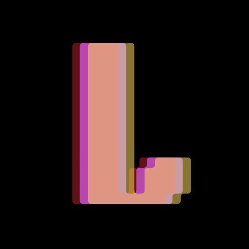

 

# L0r3nA
 Herramienta de administracion remota escrita en C++ y usando wxWidgets para la interfaz grafica.

### Funciones
- Shell Inversa
- Keylogger
- Captura de microfono y camara en tiempo real
- Escritorio Remoto
- Proxy Inversa (SOCKS4, SOCKS5, HTTP, HTTPS)
- Escaner de red
- Administrador de archivos, procesos, ventanas
- Recoleccion de informacion (Usuarios, Perfiles de Chrome)
- Bromas (Abrir y cerrar bandeja de CD, Bloquear entrada, etc)

### Descargo de responsabilidad (DISCLAIMER)
Este software esta hecho con propositos de pruebas y a modo de demostracion solamente, diseñado para ejecutarse en un ambiente controlado con previa autorizacion, no viene con ninguna garantia y no se debe ejecutar en un ambiente de trabajo real ni mucho menos hacer uso del mismo para robar informacion. El desarollador no es responsable de cualquier daño o repercusiones legales. Usalo bajo tu propio riesgo.
