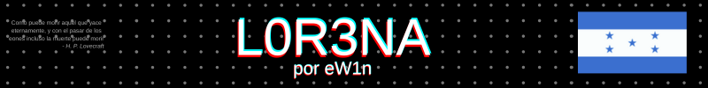
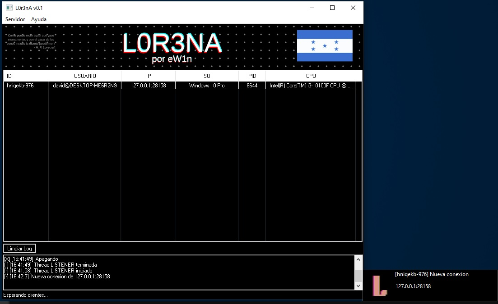
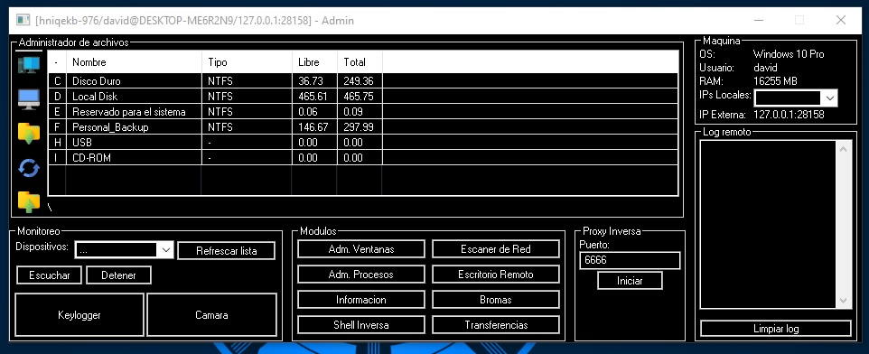
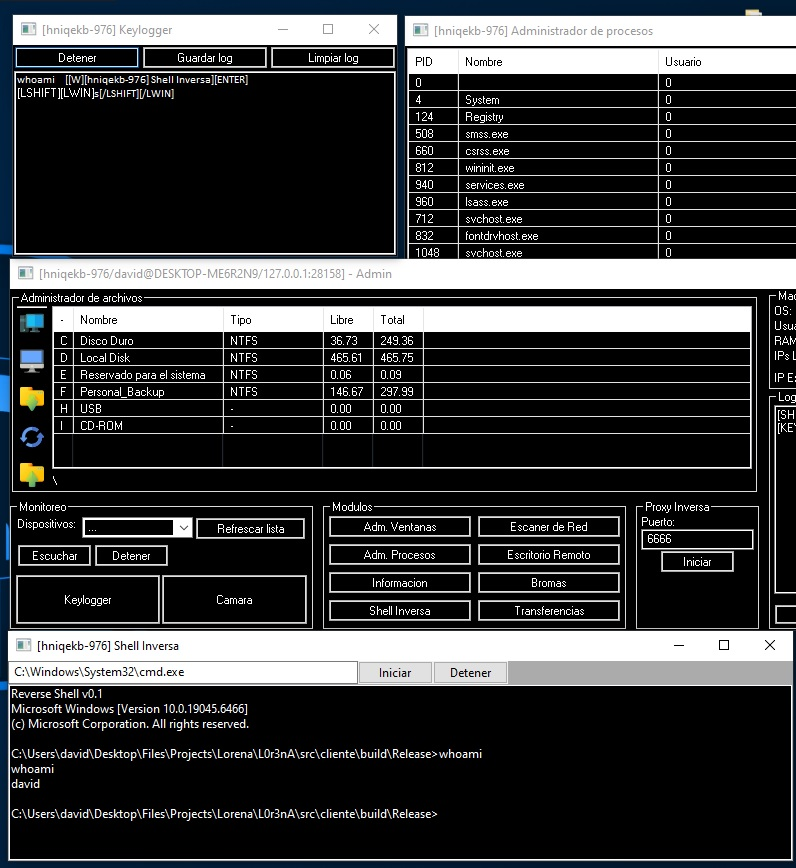

<p align="center"><br></p>

<p align="center"><b>Herramienta de administracion remota</b></p><br><br>

<p>Escrita en C++. En el lado del servidor se usa la libreria wxWidgets para la interfaz grafica. Esta por los momentos se ha mantenido simple pero se ira modificando a una mas amigable.</p>


### Dependencias del cliente
<p>El cliente usa carga dinamica de funciones en todos su modulos reduciendo en lo mas minimo el tamaño del binario. Este no depende de ninguna dll adicional mas que las que se encuentran por defecto en todo sistema Windows. Hace uso de carga dinamica para todos los modulos y es tolerante a fallas cuando la libreria no esta presente en el sistema.</p>

`ldd.exe`
```shell
ntdll.dll => /c/WINDOWS/SYSTEM32/ntdll.dll 
KERNEL32.DLL => /c/WINDOWS/System32/KERNEL32.DLL 
KERNELBASE.dll => /c/WINDOWS/System32/KERNELBASE.dll 
```
`dumpbin.exe /dependents`
```shell
KERNEL32.dll
```
<br>

### Modulos (hasta ahora)
 I  | Modulo  
---|---
 | Shell Inversa
 | Keylogger
 | Captura de microfono y camara en tiempo real 
 | Escritorio Remoto 
 | Proxy Inversa (SOCKS4, SOCKS5, HTTP, HTTPS) 
 | Escaner de red 
 | Administrador de archivos, procesos, ventanas 
 | Recoleccion de informacion (Usuarios del sistema, Perfiles de  Chrome y detalles de cada uno como historial de navegacion y mas)
 | Bromas (Abrir y cerrar bandeja de CD, Bloquear entrada, etc)
><p align="right">*Autores de los iconos en <a href="./imagenes/readme/autores.txt">./imagenes/readme/autores.txt</a></p><br>

### Compilacion
<p>Puedes usar cmake para compilar tanto el cliente como el servidor</p>
<b>Servidor</b>:

```shell
cd src && mkdir build && cd build
cmake --fresh ..
cmake --build . --config Release
xcopy /E ..\..\imagenes\Servidor\imgs Release\imgs\
```
<b>Cliente</b>:<br>
`Update: 08/12/2025 - compilacion modular`
<p>Para compilar el cliente ahora se puede hacer uso del builder integrado en el servidor:</p>

<p>La compilacion ahora es modular y solo se incluyen los modulos seleccionados en el formulario. Esto permite generar un binario mas peque&ntilde;o o uno para escenario especificos.</p>

<p>Despues de esto ya se tendrian los dos binarios listos para ser ejecutados en ambos lados para realizar la prueba.</p><br>

### Capturas de pantalla
`Ventana Principal`

`Panel de administracion`

`Builder para generar clientes`

`Keylogger, Shell y admin de procesos`


### Evasion y persistencia
<p>Actualmente no posee ningun metodo de propagacion, instalacion o evasion. Aunque debido a la encapsulacion de las llamadas dinamicas a funciones se puede implementar api unhooking/hashing de manera sencilla.</p>

### Colaboracion/Sugerencia
<p>Cualquier colaboracion y sugerencia es bienvenida. Este es un proyecto en el cual pienso seguir trabajando y agregando nuevas funcionalidades.</p>

### Descargo de responsabilidad (DISCLAIMER)
<p>Este software esta hecho con propositos de pruebas y a modo de demostracion solamente, diseñado para ejecutarse en un ambiente controlado con previa autorizacion, no viene con ninguna garantia y no se debe ejecutar en un ambiente de trabajo real ni mucho menos hacer uso del mismo para robar/dañar informacion. El desarollador no es responsable de cualquier daño o repercusiones legales. Usalo bajo tu propio riesgo.</p>
